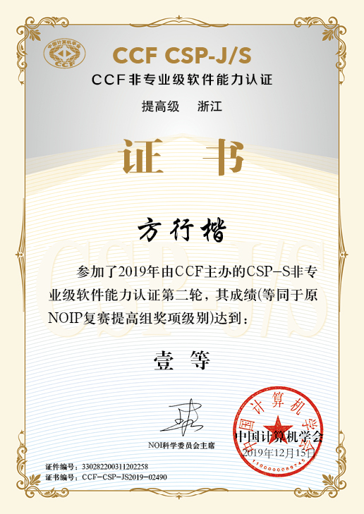
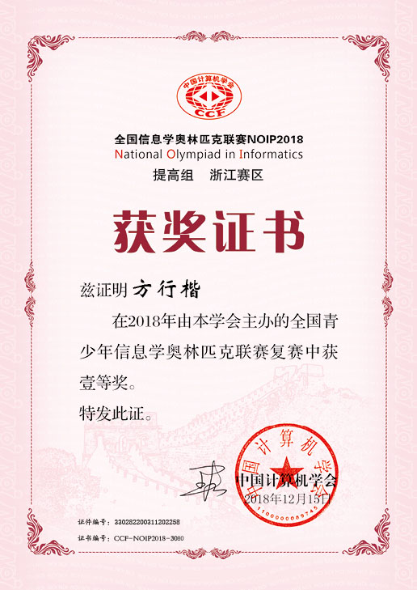
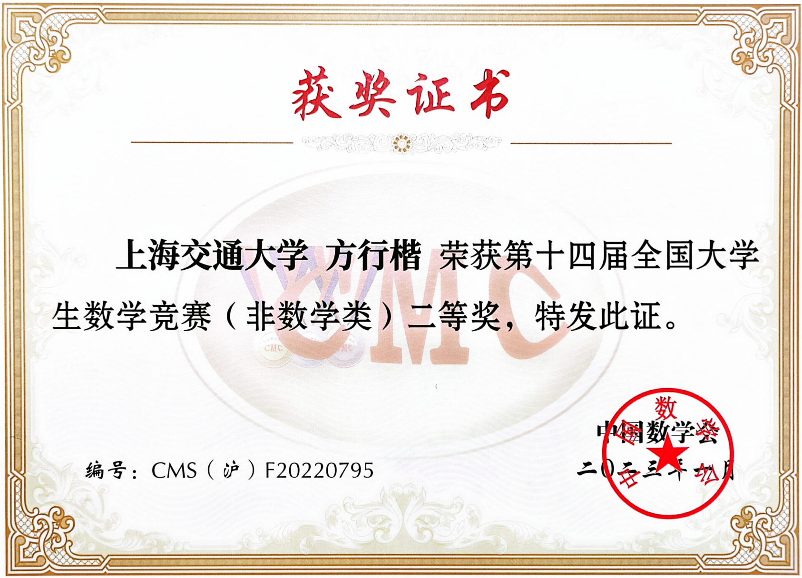
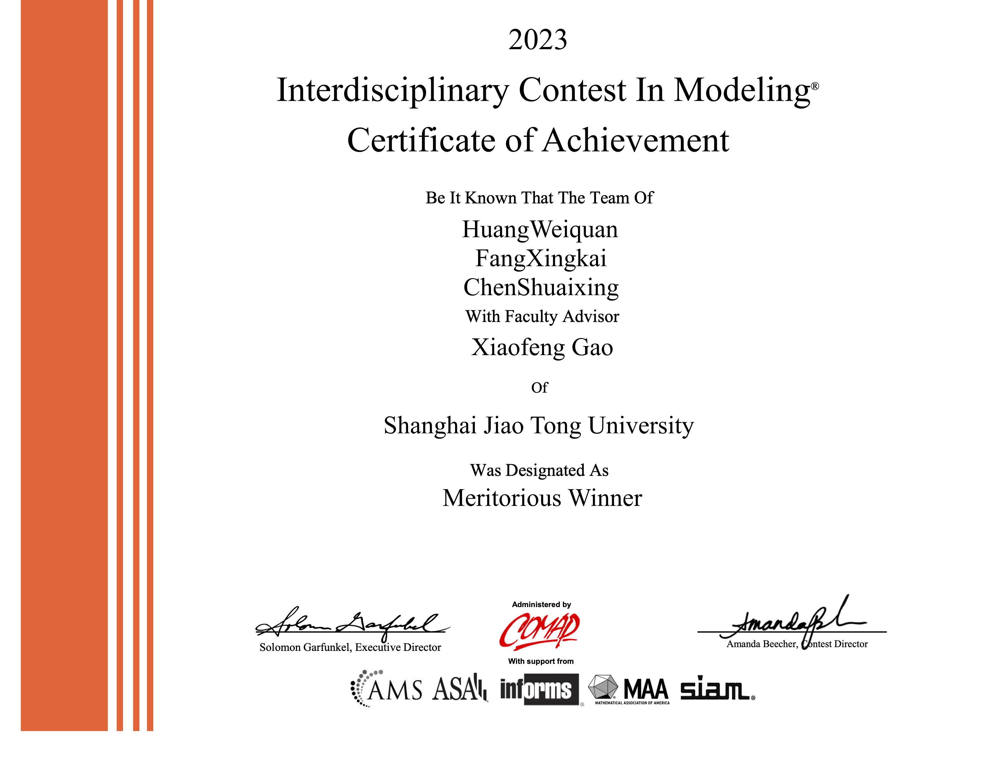
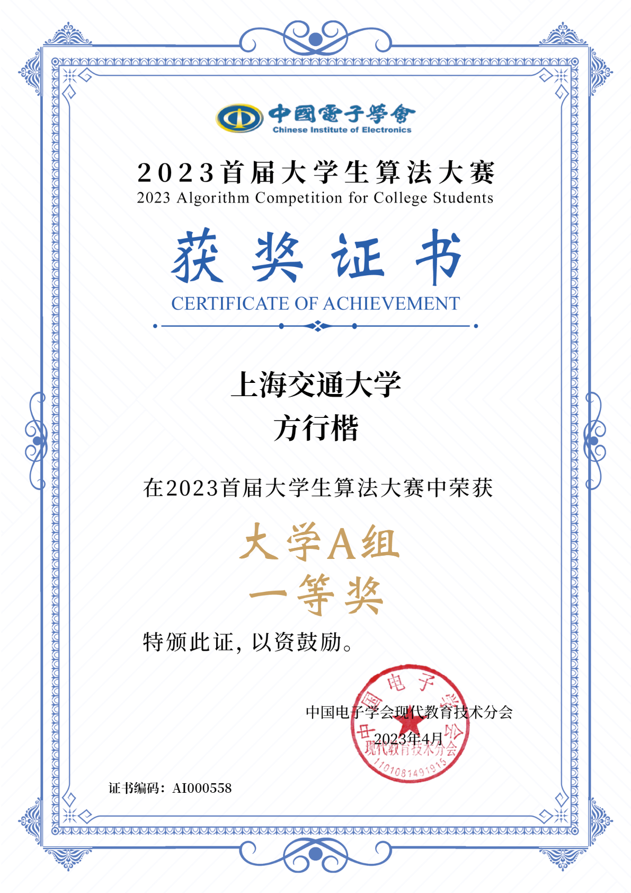
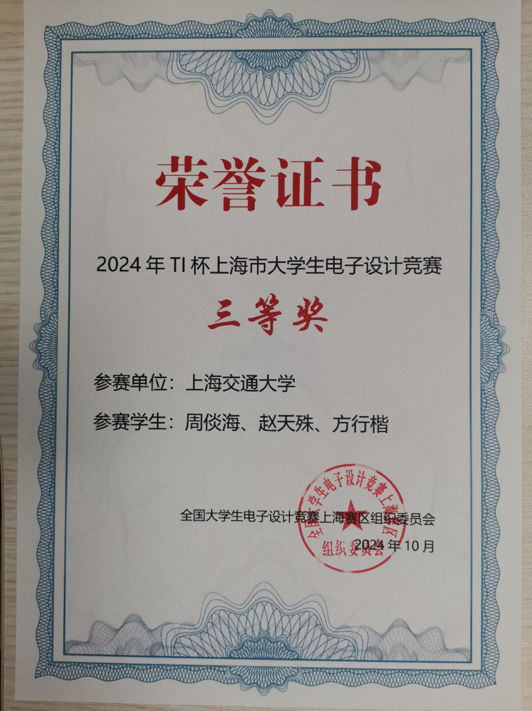

First prize in National Olympiad in Informatics, 2018 & 2019

  
  

Second prize in the Chinese Mathematics Competitions, 2022

  

Designated as Meritorious Winner with my teammates in the Interdisciplinary Contest in Modeling, 2023

  

First prize in the Algorithm Competition for College Students(大学生算法大赛), 2023

  

Third prize in TI Cup National Undergraduate Electronics Design Contest, 2024

  

