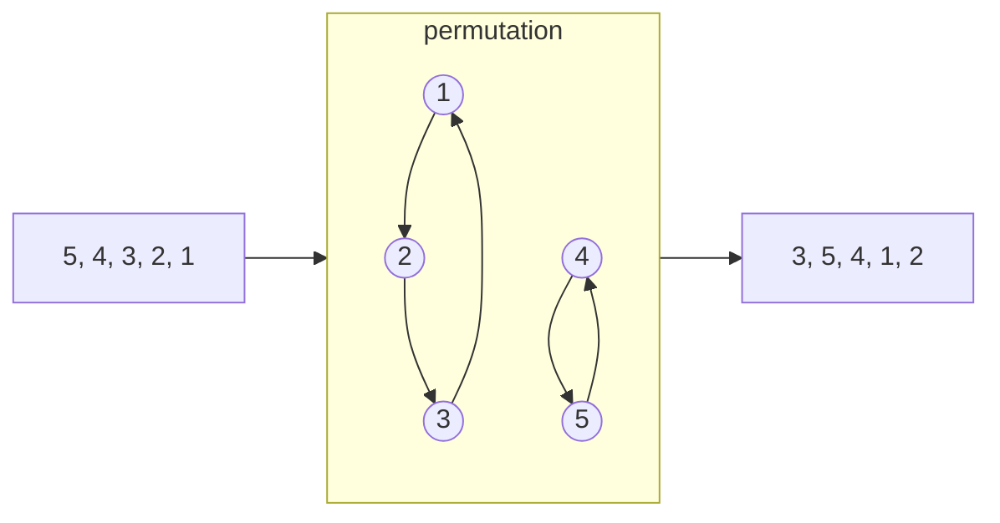

## [Problem 483](https://projecteuler.net/problem=483)




A permutation operation is a set of directed rings. So the $f(P)=LCM(\text{sizes of all rings})$

### Count Isomorphic Permutations

A permutation with $a_i$ cycles of length $i$ has count:

$$
\frac{n!}{\prod a_i ! \cdot i ^{a_i}}
$$

$$
\sum i\cdot a_i=n
$$

Selection of groups:

$$
\frac{n!}{\prod (i!)^{a_i}}
$$

Remove the order of groups:

$$
\prod a_i !
$$

One group can generate several cycles:

$$
\prod{((i-1)!)}^{a_i}
$$

Hence the count:

$$
\frac{n!}{\prod (i!)^{a_i}} / \prod a_i ! \cdot \prod{((i-1)!)}^{a_i} =\frac{n!}{\prod a_i ! \cdot i ^{a_i}}
$$

### DP

Contribution:

$$
\frac{LCM(i : a_i > 0)^2}{\prod a_i! * i^{a_i}}
$$

`dp[used][tracked_lcm] = contribution_so_far` where `used` is how many elements have been assigned to cycles, and `tracked_lcm` is the part of the lcm that still matters for future smaller cycle lengths.

The clever compression is the prime-power step. Since the DP processes cycle lengths downward, once we pass a prime power $p^k$, no smaller future cycle can introduce that same power. So if the tracked lcm is divisible by $p^k$, we can commit one factor of $p$ into the final $LCM^2$:

```py
reduced_lcm //= p
contribution *= p^2
```

## [Problem 579](https://projecteuler.net/problem=579)


A lattice cube can be described by one corner $\vec{p}$ and three integer edge vectors $\vec{u}, \vec{v}, \vec{w}$ such that:

$$
\vec{u} \cdot \vec{v}=\vec{v} \cdot \vec{w}=\vec{w} \cdot \vec{u}=0 \\
|\vec{u}|=|\vec{v}|=|\vec{w}|
$$

For each such frame, the cube's 8 vertices are:

$$
\vec{p},\quad
\vec{p}+\vec{u},\quad
\vec{p}+\vec{v},\quad
\vec{p}+\vec{w}
$$

$$
\vec{p}+\vec{u}+\vec{v},\quad
\vec{p}+\vec{u}+\vec{w},\quad
\vec{p}+\vec{v}+\vec{w},\quad
\vec{p}+\vec{u}+\vec{v}+\vec{w}
$$

In my implementation, each actual cube is counted by several equivalent ordered frames. The normalization is handled by:

```py
ORDERED_FRAMES_PER_CUBE = 24
```

So the main task becomes: generate all possible orthogonal integer triples efficiently, count their valid translations, and divide out the repeated frame count at the end.

### Generating Cube Orientations

The solver uses the Euler-Rodrigues quaternion formula. A primitive integer quaternion

$$
(a,b,c,d)
$$

Quaternion can represent a 3d rotation

$$
q=(a,b,c,d) \\
q^{-1}=(a, -b, -c, -d) \\
f(p)=q\cdot p \cdot q^{-1}
$$

[Euler Rodrigues Formula](https://en.wikipedia.org/wiki/Euler–Rodrigues_formula)

$$
\vec{x}^{\prime}=\left(\begin{array}{ccc}
a^2+b^2-c^2-d^2 & 2(b c-a d) & 2(b d+a c) \\
2(b c+a d) & a^2+c^2-b^2-d^2 & 2(c d-a b) \\
2(b d-a c) & 2(c d+a b) & a^2+d^2-b^2-c^2
\end{array}\right) \vec{x}
$$
generates a $3 \times 3$ integer matrix whose columns are mutually orthogonal and have the same squared length. After dividing by the matrix gcd, the result is a primitive lattice-cube orientation.


In code, this step has the shape:

```py
side, matrix = euler_rodrigues_matrix(a, b, c, d)
```

Here, `matrix` stores the primitive edge directions. Scaling the whole matrix by $k$ gives a larger cube with the same orientation.

### Bounding Box and Translations

For a primitive matrix $M$, the width of the cube in each coordinate direction is the sum of absolute values in each row:

```py
widths = tuple(sum(abs(value) for value in row) for row in matrix)
```

Let these widths be:

$$
(w_x,w_y,w_z)
$$

For scale $k$, the number of valid translations inside $[0,n]^3$ is:

$$
T_n(k)=(n+1-k w_x)(n+1-k w_y)(n+1-k w_z)
$$

as long as all three factors are positive.

### Lattice Points Inside the Cube

For each scaled cube, the number of lattice points inside it is computed with a 3D [Ehrhart-style formula](https://en.wikipedia.org/wiki/Ehrhart_polynomial):

$$
L(k)=1+gk+sgk^2+s^3k^3
$$

where $s$ is the side parameter of the primitive orientation, and $g$ is the sum of gcds along the three primitive edge directions.


Its 2d version is taught in primary school, pretty interesting.

### Contribution of One Orientation

Each primitive orientation contributes:

$$
\sum_k T_n(k)L(k)
$$

The product $T_n(k)L(k)$ is a degree-6 polynomial in $k$. Instead of looping over every scale one by one, we expand the polynomial and use power sums:

$$
\sum k^0,\sum k^1,\ldots,\sum k^6
$$

This makes the large case $n=5000$ much more manageable.


## [Problem 585](https://projecteuler.net/problem=585)


Classify what a denested value can look like after collecting square roots by squarefree part.

$$
R = \sqrt{x + \sqrt{y} + \sqrt{z}}
$$

$$
R = \sum c_i \sqrt{r_i}
$$
where each $r_i$ is squarefree and distinct. Then

$$
R^2 = \sum c_i^2 r_i + 2 \sum_{i<j} c_i c_j \sqrt{r_i r_j}
$$

For this to equal $x + \sqrt{y} + \sqrt{z}$, all irrational cross-terms must collapse to at most two squarefree radical directions.

That restriction forces only two real cases.

Case 1: two-term denesting

$$
R = \sqrt{A}+\sqrt{B} \\
R^2 = A + B + 2\sqrt{AB} \\
A+B\leq n
$$

Case 2: genuine four-term denesting

$$
\sqrt{gac} + \sqrt{gad} + \sqrt{gbc} - \sqrt{gbd}
$$

where

$$
a > b \\ 
c > d \\ 
gcd(a,b) = gcd(c,d) = 1 \\
g(a+b)(c+d) \leq n
$$

The rest part is easy to handle using basic number theory techniques.

## [Problem 566](https://projecteuler.net/problem=566)

Notes to be added.
