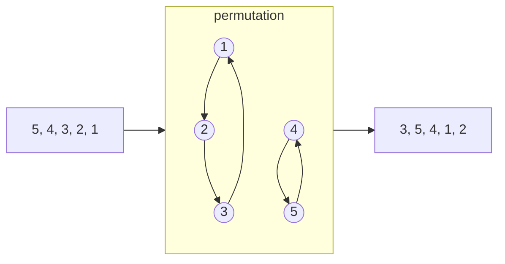

## Contents

- [Problem 483](#problem-483)
- [Problem 566](#problem-566)
- [Problem 579](#problem-579)
- [Problem 585](#problem-585)
- [Problem 597](#problem-597)
- [Problem 780](#problem-780)
- [Problem 792](#problem-792)
- [Problem 798](#problem-798)

## [Problem 483](https://projecteuler.net/problem=483)




A permutation operation is a set of directed rings. So the $f(P)=LCM(\text{sizes of all rings})$

### Count Isomorphic Permutations

A permutation with $a_i$ cycles of length $i$ has count:

$$
\frac{n!}{\prod a_i ! \cdot i ^{a_i}}
$$

$$
\sum i\cdot a_i=n
$$

Selection of groups:

$$
\frac{n!}{\prod (i!)^{a_i}}
$$

Remove the order of groups:

$$
\prod a_i !
$$

One group can generate several cycles:

$$
\prod{((i-1)!)}^{a_i}
$$

Hence the count:

$$
\frac{n!}{\prod (i!)^{a_i}} / \prod a_i ! \cdot \prod{((i-1)!)}^{a_i} =\frac{n!}{\prod a_i ! \cdot i ^{a_i}}
$$

### DP

Contribution:

$$
\frac{LCM(i : a_i > 0)^2}{\prod a_i! * i^{a_i}}
$$

`dp[used][tracked_lcm] = contribution_so_far` where `used` is how many elements have been assigned to cycles, and `tracked_lcm` is the part of the lcm that still matters for future smaller cycle lengths.

Here comes the clever compression. Since the DP processes cycle lengths downward, once we pass a prime power $p^k$, no smaller future cycle can introduce that same power. So if the tracked lcm is divisible by $p^k$, we can commit one factor of $p$ into the final $LCM^2$:

```py
reduced_lcm //= p
contribution *= p^2
```

The final answer is `dp[n][1]`

## [Problem 566](https://projecteuler.net/problem=566)


The solution is intuitive. The proof of the feasibility is also very obvious.

Let the cake in big as $ab\sqrt{c}$, the cut sizes are $b\sqrt{c}, a\sqrt{c}, ab$. We just have to keep record of the state of each piece and perform simulation.

$$
A+B\sqrt{c}
$$

That is `Coord`

```cpp
struct Coord {
    i64 A;
    i64 B;
};
```

An `Interval` is

```cpp
struct Interval {
    Coord l;
    Coord r;
    int side; //side = +1/-1  icing up/down
};
```

At the start, `std::vector<Interval> intervals{{{0, 0}, {a * b, 0}, 1}};`

### One Flip

For each interval:

If the whole interval is inside `[0, cut]`, mirror it and toggle icing.

If the interval is completely outside the cut, keep it.

If the cut boundary lands inside the interval, split it into two pieces.

### Merge

Remove zero-length intervals, sort intervals by left endpoint and merge adjacent intervals with the same icing side

This keeps the interval list from becoming messier than necessary.

### Proof of Feasibility

The important point is that the simulation never needs floating point numbers.
All boundaries can be written as

$$
A+B\sqrt{c}
$$

where $A$ and $B$ are integers. The three operations used by the game are only
addition, subtraction, reflection and reduction modulo the cake size:

$$
u \mapsto u+t,\qquad u \mapsto t-u
$$

where $t$ is one of the cut sizes. These operations preserve the form
$A+B\sqrt{c}$. So every new boundary generated by the process is still exactly
representable by the same `Coord` type.

For one flip, a cut boundary can split an existing interval at most once. Inside
an interval, the current position is affine in the original coordinate:

$$
u \mapsto u+k \quad \text{or} \quad u \mapsto -u+k
$$

So the equation "this point equals the cut boundary" has at most one solution
inside that interval. After splitting there, each resulting interval is uniform:
it is either completely flipped or completely untouched.

Equivalently, after all relevant boundaries have been inserted, the cake becomes
a finite collection of atoms. One full $x,y,z$ round sends each atom to another
atom and records whether its icing side was toggled. Thus the process is a
finite signed permutation:

$$
\text{atom } i \mapsto \text{atom } j,\quad \text{flip bit } 0/1
$$

Every finite signed permutation has finite order. On each cycle, if the total
flip parity is even, that cycle returns after its ordinary length; if the parity
is odd, it returns after twice its length. Taking the lcm over all atom cycles
gives a finite return time. This proves that the icing eventually comes back to
the top.


## [Problem 579](https://projecteuler.net/problem=579)


A lattice cube can be described by one corner $\vec{p}$ and three integer edge vectors $\vec{u}, \vec{v}, \vec{w}$ such that:

$$
\vec{u} \cdot \vec{v}=\vec{v} \cdot \vec{w}=\vec{w} \cdot \vec{u}=0 \\
|\vec{u}|=|\vec{v}|=|\vec{w}|
$$

For each such frame, the cube's 8 vertices are:

$$
\vec{p},\quad
\vec{p}+\vec{u},\quad
\vec{p}+\vec{v},\quad
\vec{p}+\vec{w}
$$

$$
\vec{p}+\vec{u}+\vec{v},\quad
\vec{p}+\vec{u}+\vec{w},\quad
\vec{p}+\vec{v}+\vec{w},\quad
\vec{p}+\vec{u}+\vec{v}+\vec{w}
$$

In the implementation, each actual cube is counted 24 times.

So the main task becomes: 1. generate all possible orthogonal integer triples efficiently; 2. count their valid translations; 3. divide out the repeated frame count at the end.

### Generating Cube Orientations

The solver uses the Euler-Rodrigues quaternion formula. 

Quaternion $(a, b, c, d)$ can represent a 3d rotation

$$
q=(a,b,c,d) \\
q^{-1}=(a, -b, -c, -d) \\
f(p)=q\cdot p \cdot q^{-1}
$$

can also be represented by 

$$
q=a+bi+cj+ck \\
a^2+b^2+c^2+d^2=1 \\
i^2=j^2=k^2=ijk=-1 \\
ij=k, jk=i, ki=j
$$

[Euler Rodrigues Formula](https://en.wikipedia.org/wiki/Euler–Rodrigues_formula)

$$
\vec{x}^{\prime}=\left(\begin{array}{ccc}
a^2+b^2-c^2-d^2 & 2(b c-a d) & 2(b d+a c) \\
2(b c+a d) & a^2+c^2-b^2-d^2 & 2(c d-a b) \\
2(b d-a c) & 2(c d+a b) & a^2+d^2-b^2-c^2
\end{array}\right) \vec{x}
$$

It's a $3 \times 3$ integer matrix whose columns are mutually orthogonal and have the same squared length. After dividing by the matrix gcd, the result is a primitive lattice-cube orientation.

Visualization: https://eater.net/quaternions

Example:

$$
\begin{aligned}
(a, b, c, d) &= (4, 3, 2, 1) \\
\mathbf{M}_{raw}
&=
\begin{pmatrix}
20 & 4 & 22 \\
20 & 10 & -20 \\
-10 & 28 & 4
\end{pmatrix}
\end{aligned}
$$

The matrix gcd is $2$, so the primitive orientation matrix is:

$$
\mathbf{M}
=
\begin{pmatrix}
10 & 2 & 11 \\
10 & 5 & -10 \\
-5 & 14 & 2
\end{pmatrix}
$$

So the three primitive edge vectors are the columns of $\mathbf{M}$:

$$
\vec{u}=(10,10,-5),\quad
\vec{v}=(2,5,14),\quad
\vec{w}=(11,-10,2)
$$

They all have the same squared length:

$$
|\vec{u}|^2=|\vec{v}|^2=|\vec{w}|^2=225
$$

Scaling the whole matrix by $k$ gives a larger cube with the same orientation.

### Bounding Box and Translations

For a primitive matrix $M$, the width of the cube in each coordinate direction is the sum of absolute values in each row:

$$
w_r=\sum_{j=1}^{3}|M_{rj}|,\quad r\in\{x,y,z\}
$$

Let these widths be:

$$
(w_x,w_y,w_z)
$$

For the example above:

$$
\begin{aligned}
w_x &= |10|+|2|+|11|=23 \\
w_y &= |10|+|5|+|-10|=25 \\
w_z &= |-5|+|14|+|2|=21
\end{aligned}
$$

For scale $k$, the number of valid translations inside $[0,n]^3$ is:

$$
T_n(k)=(n+1-k w_x)(n+1-k w_y)(n+1-k w_z)
$$

as long as all three factors are positive.

### Lattice Points Inside the Cube

For each scaled cube, the number of lattice points inside it is computed with a 3D [Ehrhart-style formula](https://en.wikipedia.org/wiki/Ehrhart_polynomial):

$$
L(k)=1+gk+sgk^2+s^3k^3
$$

where $s$ is the side parameter of the primitive orientation, and $g$ is the sum of gcds along the three primitive edge directions.


Its 2D version is taught in primary school, pretty interesting.


### Contribution of One Orientation

Each primitive orientation contributes:

$$
\sum_k T_n(k)L(k)
$$

The product $T_n(k)L(k)$ is a degree-6 polynomial in $k$. Instead of looping over every scale one by one, we expand the polynomial and use power sums:

$$
\sum k^0,\sum k^1,\ldots,\sum k^6
$$

This makes the large case much more manageable.


## [Problem 585](https://projecteuler.net/problem=585)


Classify what a denested value can look like after collecting square roots by squarefree part.

$$
R = \sqrt{x + \sqrt{y} + \sqrt{z}}
$$

$$
R = \sum c_i \sqrt{r_i}
$$
where each $r_i$ is squarefree and distinct. Then

$$
R^2 = \sum c_i^2 r_i + 2 \sum_{i<j} c_i c_j \sqrt{r_i r_j}
$$

For this to equal $x + \sqrt{y} + \sqrt{z}$, all irrational cross-terms must collapse to at most two squarefree radical directions.

That restriction forces only two real cases.

### Case 1: Two-term Denesting

$$
R = \sqrt{A}+\sqrt{B} \\
R^2 = A + B + 2\sqrt{AB} \\
A+B\leq n
$$

### Case 2: Genuine Four-term Denesting

$$
\sqrt{gac} + \sqrt{gad} + \sqrt{gbc} - \sqrt{gbd}
$$

where

$$
a > b \\ 
c > d \\ 
gcd(a,b) = gcd(c,d) = 1 \\
g(a+b)(c+d) \leq n
$$

Squaring that gives:

$$
g(a+b)(c+d) + 2g(a-b)\sqrt{cd} + 2g(c-d)\sqrt{ab}
$$

Then count primitive pairs $(a,b)$ by their sum $a+b$. For each pair of sums $s,t$, there are: $\lfloor n / (s t)\rfloor$ valid choices of $g$. 

$ab$ and $cd$ must not be squares.

The rest part is easy to handle using basic number theory techniques.

## [Problem 597](https://projecteuler.net/problem=597)


We label the boats from lowest to highest $ 1,2,3,\ldots,n $

The standardized distance is $ \frac{L}{40}=45 $

Boat `i` has to travel distance: $ 46-i $

The speed formula is:

$$
v_i=-\log(X_i)
$$

where $X_i$ is uniform between `0` and `1`. That means each speed is an
exponential random variable.

Now define each boat's "relative speed to the target":

$$
\frac{v_i}{\text{target}-i}
$$

This measures how quickly boat `i` would reach the current target. A higher
value means it reaches the target sooner. A lower value means it is slow
relative to that target.

The key observation is:

> In any consecutive block of boats, the boat with the smallest relative speed
> to the current target ends up lowest in that block's final order.

Boat `k` becomes the bottom boat of that block's final order.

Then the race splits into two independent smaller races:

$$
\begin{aligned}
\text{boats below }k &\longrightarrow \text{race toward }k, \\
\text{boats above }k &\longrightarrow \text{race toward the old target}.
\end{aligned}
$$

### Parity of Permutations

Now we also need to know whether the final permutation is even or odd. Instead of computing even probability directly, I compute the expected sign:

$$
\operatorname{sign}(\pi)=
\begin{cases}
+1, & \pi\text{ is even}, \\
-1, & \pi\text{ is odd}.
\end{cases}
$$

Then:

$$
E=\Pr(\text{even})-\Pr(\text{odd}),\qquad
\Pr(\text{even})+\Pr(\text{odd})=1
$$

so:

$$
\Pr(\text{even})=\frac{1+E}{2}
$$

When boat `k` becomes the lowest boat in the block, it moves past: $ k-\text{lo} $ boats. Each swap changes parity, so the sign contribution is:

$$
(-1)^{k-\text{lo}}
$$

So the recurrence is:

$$
\begin{aligned}
\operatorname{expected\_sign}(\text{block})
=\sum_k
&\Pr(k\text{ is slowest}) \\
&\cdot (-1)^{k-\text{lo}} \\
&\cdot \operatorname{expected\_sign}(\text{left subrace}) \\
&\cdot \operatorname{expected\_sign}(\text{right subrace}).
\end{aligned}
$$

```python
lower = expected_sign(lo, slowest - 1, Fraction(slowest))
higher = expected_sign(slowest + 1, hi, target)
```

### Probability Calculation

`P(k is slowest)` means:

$$
\Pr(\text{boat }k\text{ has the smallest relative speed toward the current target})
$$

Suppose the current target is at position `t`, and boat `i` is at position `i`.
Then boat `i` has distance:

$$
d_i=t-i
$$

Its actual speed is:

$$
V_i=-\log(X_i)
$$

So the relative speed is:

$$
Y_i=\frac{V_i}{d_i}
$$

$$
\begin{aligned}
\Pr(Y_i>y)
&=\Pr\left(\frac{V_i}{d_i}>y\right) \\
&=\Pr(V_i>d_i y) \\
&=e^{-d_i y}
\end{aligned}
$$

$$
\operatorname{PDF}(Y_i=y) = d_i e^{-d_i y}
$$


For independent exponential variables, the chance that one is the minimum is
its rate divided by the sum of all rates:

$$
\begin{aligned}
\Pr(Y_k\text{ is smallest}) &= \int_{y=0}^{+\infty} \operatorname{PDF}(Y_k =y)\cdot \prod_{i\neq k} \Pr(Y_k>y) \\
&= \int_{y=0}^{+\infty}d_k \prod e^{-d_i y} \\
&=\frac{d_k}{d_{\text{lo}}+d_{\text{lo}+1}+\cdots+d_{\text{hi}}} \\
&=\frac{t-k}{\sum_{i=\text{lo}}^{\text{hi}}(t-i)}
\end{aligned}
$$

## [Problem 780](https://projecteuler.net/problem=780)


By applying the fact that $m$ in the demo is an integer, it can be easily proven that $x$ and $y$ are also integers. First prove rationality, then integrality.

Thus, the spliced torus are all aligned triangles.


The main equations are these.

Take the infinite triangular grid generated by two unit vectors:

$$
\vec e_1=(1,0),\qquad
\vec e_2=\left(\frac12,\frac{\sqrt3}{2}\right)
$$

Every lattice point is

$$
u\vec e_1+v\vec e_2
$$

where $u,v\in\mathbb Z$.

A rectangular torus tiling comes from choosing two lattice vectors $\vec A$ and $\vec B$ that become the horizontal and vertical wrap directions:

$$
\vec A=a\vec e_1+b\vec e_2,\qquad
\vec B=c\vec e_1+d\vec e_2
$$

with $a,b,c,d\in\mathbb Z$.

Because the torus is rectangular, these two wrap vectors must be perpendicular:

$$
\vec A\cdot \vec B=0
$$

Using the triangular-lattice dot product, this becomes:

$$
2ac+ad+bc+2bd=0
$$

That is the key “rectangular torus” equation.

The number of unit triangles inside the torus is determined by the area. The area of the parallelogram spanned by $\vec A$ and $\vec B$ is

$$
|ad-bc|\cdot \frac{\sqrt3}{2}
$$

A unit equilateral triangle has area

$$
\frac{\sqrt3}{4}
$$

so the number of triangles is

$$
n=2|ad-bc|
$$

So, for exactly $n$ triangles, we need integer solutions to:

$$
\begin{cases}
2ac+ad+bc+2bd=0, \\
2|ad-bc|=n.
\end{cases}
$$

That is the arithmetic core of the problem.

For example, the simplest torus with two triangles uses:

$$
\vec A=\vec e_1,\qquad
\vec B=\vec e_2-\vec e_1
$$

In coordinates:

$$
\vec A=(1,0),\qquad
\vec B=(-1,1)
$$

Check perpendicularity:

$$
2(1)(-1)+(1)(1)+(0)(-1)+2(0)(1)
=-2+1
=-1
$$

Oops, that pair is not perpendicular. The actual rectangular $1\times\frac{\sqrt3}{2}$ two-triangle torus can be represented with horizontal vector:

$$
\vec A=\vec e_1
$$

and vertical vector:

$$
\vec B=2\vec e_2-\vec e_1=(0,\sqrt3)
$$

but that rectangle contains four unit triangles. For the two-triangle example, the rectangle is not aligned with two independent triangular-lattice translation vectors in the naive way; the boundary identification can cut through triangle edges, so a slightly more general “strip” representation is needed.

That is why the full solution has more complicated sums. But the intuition still comes from the same structure:

```text
triangular lattice + rectangular periodicity + fixed area
```

The formula I mentioned earlier counts all possible integer wrapping patterns.

The cumulative count is written as:

$$
G(N)=\operatorname{strip\_part}(N)-4H\left(\left\lfloor\frac N4\right\rfloor\right)
$$

The generic strip part is:

$$
\operatorname{strip\_part}(N)
=2D\left(\left\lfloor\frac N2\right\rfloor\right)
+4\sum_{uv\leq \left\lfloor\frac{N}{2\sqrt3}\right\rfloor}
\left(
\left\lfloor\frac{N}{2\gcd(u,v)}\right\rfloor
-\left\lfloor\frac{\sqrt3\,uv}{\gcd(u,v)}\right\rfloor
\right)
$$

where

$$
D(m)=\sum_{i=1}^m \left\lfloor\frac mi\right\rfloor
$$

The correction term uses the triangular-lattice quadratic form:

$$
Q(u,v)=u^2+uv+v^2
$$

This expression is just the squared length of the lattice vector:

$$
u\vec e_1+v\vec e_2
$$

because:

$$
\left|u\vec e_1+v\vec e_2\right|^2=u^2+uv+v^2
$$

The hexagonal correction is:

$$
H(X)=D(X)+2\sum D\left(\left\lfloor\frac{X}{Q(u,v)}\right\rfloor\right)
$$

over primitive pairs satisfying:

$$
u>v\geq 1,\qquad
\gcd(u,v)=1,\qquad
(2u+v)\bmod 3\neq 0,\qquad
Q(u,v)\leq X
$$

So the important equations are:

$$
\vec e_1=(1,0),\qquad
\vec e_2=\left(\frac12,\frac{\sqrt3}{2}\right)
$$

$$
Q(u,v)=u^2+uv+v^2
$$

$$
D(m)=\sum_{i=1}^m\left\lfloor\frac mi\right\rfloor
$$

$$
G(N)=\operatorname{strip\_part}(N)-4H\left(\left\lfloor\frac N4\right\rfloor\right)
$$

The first two describe the geometry. The last two are the optimized counting formula.


## [Problem 792](https://projecteuler.net/problem=792)


### Lemma 1

$$
\sum \binom{2k}{k}x^k = \frac{1}{\sqrt{1 - 4x}}
$$

#### The Generalized Binomial Theorem
The generalized binomial theorem states that for any real number $\alpha$, the
expansion of $(1 + y)^\alpha$ is given by:

$$
(1 + y)^\alpha = \sum_{k=0}^{\infty} \binom{\alpha}{k} y^k
$$

#### Set Up the Function
We want to find the series expansion for the right side of your equation. We can rewrite the function as a fractional power:

$$
\frac{1}{\sqrt{1 - 4x}} = (1 - 4x)^{-1/2}
$$

By matching this to the generalized binomial theorem, we can set $y=-4x$ and
$\alpha=-1/2$. Plugging these into the theorem gives:

$$
(1 - 4x)^{-1/2} = \sum_{k=0}^{\infty} \binom{-1/2}{k} (-4x)^k
$$

#### Expand the Fractional Binomial Coefficient

The core of the proof is simplifying the term $\binom{-1/2}{k}$. 

$$
\binom{-1/2}{k} = \frac{(-\frac{1}{2})(-\frac{3}{2})(-\frac{5}{2}) \cdots (-\frac{2k-1}{2})}{k!} \\
 = \frac{(-1)^k}{2^k k!} [1 \cdot 3 \cdot 5 \cdots (2k - 1)]
$$

$$
2 \cdot 4 \cdot 6 \cdots 2k = 2^k (1 \cdot 2 \cdot 3 \cdots k) = 2^k k!
$$

Multiplying the top and bottom by $2^k k!$ yields:

$$
\binom{-1/2}{k} = \frac{(-1)^k [1 \cdot 3 \cdots (2k - 1)] \cdot [2 \cdot 4 \cdots 2k]}{(2^k k!) \cdot (2^k k!)}
$$

$$
\binom{-1/2}{k} = \frac{(-1)^k}{4^k} \binom{2k}{k}
$$

### How to Derive the Generating Function from Scratch
The most powerful and standard technique is to use differential equations.

#### Find the Recurrence Relation

Let $a_k=\binom{2k}{k}$. We want to find a relationship between the next term
$a_{k+1}$ and the current term $a_k$. Let's look at their ratio:

$$
\frac{a_{k+1}}{a_k} = \frac{\binom{2k+2}{k+1}}{\binom{2k}{k}}
= \frac{4k+2}{k+1}
$$

#### Define the Function and its Derivative

Let $F(x)$ be the generating function we are trying to find:

$$
F(x) = \sum_{k=0}^{\infty} a_k x^k
$$

Now, take the derivative of $F(x)$ with respect to $x$:

$$
F'(x) = \sum_{k=1}^{\infty} k a_k x^{k-1}
= \sum_{k=0}^{\infty} (k+1) a_{k+1} x^k
$$

#### Translate the Recurrence into a Differential Equation

Now, take the recurrence relation and multiply every term by $x^k$, then sum
from $k=0$ to infinity:

$$
\sum_{k=0}^{\infty} (k+1)a_{k+1} x^k
= \sum_{k=0}^{\infty} 4ka_k x^k
+ \sum_{k=0}^{\infty} 2a_k x^k
$$

Let's convert each of these sums into expressions of $F(x)$ and $F'(x)$:

$$
F'(x) = 4xF'(x) + 2F(x)
$$

#### Solve the Differential Equation

$$
\frac{F'(x)}{F(x)} = \frac{2}{1 - 4x}
$$

Integrate both sides with respect to x:

$$
\int \frac{1}{F(x)} dF = \int \frac{2}{1 - 4x} dx
$$

$$
\ln(F(x)) = \ln((1 - 4x)^{-1/2}) + C
$$

Exponentiate both sides to solve for $F(x)$:

$$
F(x) = e^C(1 - 4x)^{-1/2}
$$

#### Find the Constant

$$
F(0)=\binom{0}{0}=1 \implies e^C = 1
$$

Therefore, the constant multiplier is just 1, and you arrive at your final closed-form equation:

$$
F(x) = (1 - 4x)^{-1/2} = \frac{1}{\sqrt{1 - 4x}}
$$

### Lemma 2

$$
v_2\left(\binom{2k}{k}\right)=s_2(k)
$$

where $s_2(k)$ is the number of $1$ bits in the binary representation of $k$.

#### Legendre's Formula

Legendre's formula states that for any prime $p$ and integer $n$:

$$
v_p(n!) = \frac{n - s_p(n)}{p - 1}
$$

where $s_p(n)$ is the sum of the digits of $n$ written in base $p$.

For $p=2$, this becomes:

$$
v_2(n!) = n - s_2(n)
$$

#### Apply It to the Central Binomial Coefficient

Start from the factorial form:

$$
\binom{2k}{k} = \frac{(2k)!}{(k!)^2}
$$

Using the additivity of valuations:

$$
\begin{aligned}
v_2\left(\binom{2k}{k}\right)
&= v_2((2k)!)-2v_2(k!) \\
&= (2k - s_2(2k))-2(k-s_2(k)) \\
&= 2s_2(k)-s_2(2k) \\
&= s_2(k)
\end{aligned}
$$

### Solution

The trick is to stop trying to compute $S(n)$ directly.

$$
R(k)=(-2)^k\binom{2k}{k}
$$

$$
S(n)=R(1)+R(2)+\cdots+R(n)
$$

The central-binomial generating function is

$$
\sum_{k\geq 0}\binom{2k}{k}x^k=\frac{1}{\sqrt{1-4x}}
$$

At $x=-2$, in the 2-adics,

$$
\sum_{k\geq 0}R(k)=-\frac{1}{3}
$$

$$
\sum_{k\geq 1}R(k)=-\frac{4}{3}
$$

Therefore the infinite version satisfies:

$$
3\sum_{k\geq 1}R(k)+4=0
$$

Hence for finite $n$:

$$
3S(n)+4=-3\sum_{k>n}R(k)
$$

Since $-3$ is odd, it does not change the 2-adic valuation:

$$
u(n)=v_2\left(\sum_{k>n}R(k)\right)
$$

So $u(n)$ is the valuation of the tail, not the huge original sum.

For each term,

$$
\begin{aligned}
v_2(R(k))
&=v_2((-2)^k)+v_2\left(\binom{2k}{k}\right) \\
&=k+s_2(k)
\end{aligned}
$$

That means the tail terms rapidly gain powers of two. If we sum only

$$
R(n+1),R(n+2),\dots,R(n+m)
$$

then the remaining tail is divisible by at least $2^{n+m+1}$

So once the partial tail has valuation below $n+m+1$, that valuation is final.

To avoid massive binomial coefficients, use the ratio

$$
\frac{R(k+1)}{R(k)}=-4\cdot\frac{2k+1}{k+1}
$$

and do modular 2-adic arithmetic, tracking:

$$
R(k)=2^e\cdot\operatorname{odd\_part}(R(k))
$$


## [Problem 798](https://projecteuler.net/problem=798)


This is pretty interesting problem combining CGT and FWHT acceleration.

The solution has two layers: first solve one suit as an impartial game, then combine the $s$ suits by xor.

### Split by Suits

A move only affects one suit, so the whole game is the disjoint sum of $s$ independent games.

For the definition and useful properties of Grundy numbers, see [Two Often-Used Methods in CGT](/blog/two-often-used-methods-in-cgt/).

For each suit, let its Grundy number be $g$. The first player loses exactly when

$$
g_1 \oplus g_2 \oplus \cdots \oplus g_s = 0
$$

So the main task is: for one suit with $n$ cards, count how many initial visible sets have each Grundy value.

Call that array:

$$
A_n[g] = \#\{\text{one-suit initial sets with Grundy value } g\}
$$

The empty set has Grundy value 0, because no move is possible.

### One-Suit Grundy Counts

For one suit, we use recurrence for the distribution $A_n$, rather than enumerating subsets.

Although the pattern is easy to find by brute-forcing the first few distributions, the proof of it is quite cumbersome. There might be more easier ways to prove it, if you find it, please send me an email.

#### Pattern

The key recurrence is:

$$
\begin{aligned}
A_n(0) &= 2A_{n-1}(0) - 2, \\
A_n(1) &= A_{n-1}(0) + A_{n-1}(1) - 1.
\end{aligned}
$$

For $g \geq 2$:

$$
A_n(g) =
\begin{cases}
A_{n-1}(g - 1), & g \text{ is even}, \\
A_{n-1}(g) + A_{n-1}(g - 1), & g \text{ is odd}.
\end{cases}
$$

with base:

$$
A_2 = [3, 1]
$$

#### Proof

##### Lemma

For $1\leq x_1 < x_2 < \dots < x_k \leq n$

if $x_1 \equiv x_2 \equiv \dots \equiv x_k \mod 2$, then:

$$
G_n(\{x_1, x_2, \dots, x_k \}) = n - x_1 - (k - 1)
$$

otherwise, let $t > 1$ be the smallest number that satisfies $x_t\not\equiv x_1 \mod 2$

$$
G_n(\{x_1, x_2, \dots, x_k \}) = x_t - x_1 - (n - x_1 - (k - 1) +1)\% 2
$$

##### Proof of Lemma

We use mathematical induction.

Let $m=n - x_1 - (k-1)$

For the first case, we can manipulate the state with any Grundy number $g=G_{n-1}(\{x_1, x_2, \dots, x_{p-1}, x_{p+1} - 1, x_{p+2} - 1, \dots, x_k - 1\} \cup \{u\}) < m$, where $1\leq p \leq k$

And then $G_{n}(\{x_1, x_2, \dots, x_k\}) = \operatorname{mex}\{G_{n-1}(\text{Reachable Set})\}$

If m is odd, then m-1 is even.
For Grundy number $g$ that is even, if $g < x_2 - x_1$, then we cover $x_1$ by $x_2 - g - 1$; if $x_2 - x_1 leq g < x_3-x_1$, cover $x_2$ by $x_1 + g + 1$; if $x_p - x_ 1 < g < x_{p+1} - x_1, p > 3$, cover $x_p$ by $x_1+g+1$; if $g=x_p-x_1, p > 3$, cover $x_p$ by any card number larger than $x_{p+1}$


For the rest cases, I believe they are just the similar. I have found myself wasting too much time on proving the non-sense. I'm getting really irritable analysing the cases. So I decided to give myself a break.

##### Proof of the Recurrence Equations

To be continued...

#### Calculation

Naively applying that recurrence is quadratic, but we can compress it further.

$$
B_n(k) = A_n(2k + 1) \\
A_n(2k) = B_{n-1}(k - 1)
$$

First, solve the zero-Grundy count. Since

$$
A_n(0) = 2A_{n-1}(0) - 2,\qquad A_2(0)=3,
$$

we get

$$
A_n(0)=2^{n-2}+2.
$$

For $k\geq 1$, the value $2k+1$ is an odd Grundy number at least $3$, so the
main recurrence gives:

$$
\begin{aligned}
B_n(k)
&= A_n(2k+1) \\
&= A_{n-1}(2k+1) + A_{n-1}(2k) \\
&= B_{n-1}(k) + B_{n-2}(k-1).
\end{aligned}
$$

The only missing coefficient is the constant term $k=0$, because $A_n(1)$ has
its own recurrence:

$$
\begin{aligned}
B_n(0)
&= A_n(1) \\
&= A_{n-1}(0) + A_{n-1}(1) - 1 \\
&= (2^{n-3}+2) + B_{n-1}(0) - 1 \\
&= B_{n-1}(0) + 2^{n-3} + 1.
\end{aligned}
$$

The odd-count polynomial

$$
Q_n(z) = \sum_k B_n(k)z^k
$$

satisfies:

$$
Q_n(z) = Q_{n-1}(z) + zQ_{n-2}(z) + 2^{n-3} + 1
$$

The code turns this into an $O(n)$ coefficient pass using binomial coefficient ratios and small geometric convolutions.

### Combine Suits with FWHT

Once we have the one-suit count vector $A$, the answer is the number of ordered $s$-tuples of Grundy values whose xor is zero.

Let

$$
A[g] = \#\{\text{one-suit states with Grundy value }g\}.
$$

If there are two suits, the number of ways to get total Grundy value $x$ is

$$
(A *_\oplus A)[x] =
\sum_{u\oplus v=x} A[u]A[v].
$$

This is xor convolution. For $s$ suits, we need the coefficient at $0$ in the
$s$-fold xor convolution:

$$
\underbrace{A *_\oplus A *_\oplus \cdots *_\oplus A}_{s\text{ times}}.
$$

Computing that convolution directly is too slow when $s$ and $n$ are large, but
xor convolution is exactly what the Fast Walsh-Hadamard Transform diagonalizes.

#### Introduction to FWHT

For an array $f$ of length $L$, define

$$
\widehat f[t] =
\sum_x (-1)^{\operatorname{popcount}(x\&t)}f[x].
$$

Then

$$
\widehat{(f *_\oplus h)}[t] = \widehat{f}[t]\widehat{h}[t].
$$

So after transforming $A$, the $s$-fold xor convolution becomes pointwise
exponentiation:

$$
\widehat{A^{*_\oplus s}}[t] = \widehat A[t]^s.
$$

The inverse FWHT is the same transform divided by $L$. Therefore the coefficient
at xor value $0$ is

$$
A^{*_\oplus s}[0]
= \frac{1}{L}\sum_t
(-1)^{\operatorname{popcount}(0\&t)}\widehat A[t]^s.
$$

Since $\operatorname{popcount}(0\&t)=0$, the sign is always $1$. The final
formula is:

$$
\text{answer}
= \frac{1}{L}\sum_t \operatorname{FWHT}(A)[t]^s
$$

where $L$ is the next power of two at least $n$, and $A$ is padded with zeroes
up to length $L$.
