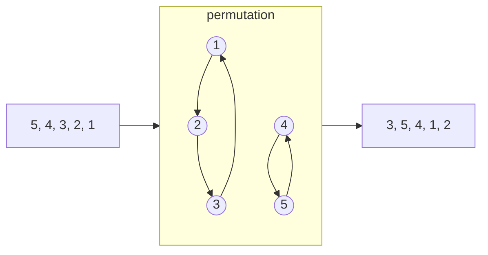

## [Problem 483](https://projecteuler.net/problem=483)




A permutation operation is a set of directed rings. So the $f(P)=LCM(\text{sizes of all rings})$

### Count Isomorphic Permutations

A permutation with $a_i$ cycles of length $i$ has count:

$$
\frac{n!}{\prod a_i ! \cdot i ^{a_i}}
$$

$$
\sum i\cdot a_i=n
$$

Selection of groups:

$$
\frac{n!}{\prod (i!)^{a_i}}
$$

Remove the order of groups:

$$
\prod a_i !
$$

One group can generate several cycles:

$$
\prod{((i-1)!)}^{a_i}
$$

Hence the count:

$$
\frac{n!}{\prod (i!)^{a_i}} / \prod a_i ! \cdot \prod{((i-1)!)}^{a_i} =\frac{n!}{\prod a_i ! \cdot i ^{a_i}}
$$

### DP

Contribution:

$$
\frac{LCM(i : a_i > 0)^2}{\prod a_i! * i^{a_i}}
$$

`dp[used][tracked_lcm] = contribution_so_far` where `used` is how many elements have been assigned to cycles, and `tracked_lcm` is the part of the lcm that still matters for future smaller cycle lengths.

Here comes the clever compression. Since the DP processes cycle lengths downward, once we pass a prime power $p^k$, no smaller future cycle can introduce that same power. So if the tracked lcm is divisible by $p^k$, we can commit one factor of $p$ into the final $LCM^2$:

```py
reduced_lcm //= p
contribution *= p^2
```

The final answer is `dp[n][1]`

## [Problem 566](https://projecteuler.net/problem=566)


The solution is intuitive. The proof of the feasibility is also very obvious.

Let the cake in big as $ab\sqrt{c}$, the cut sizes are $b\sqrt{c}, a\sqrt{c}, ab$. We just have to keep record of the state of each piece and perform simulation.

$$
A+B\sqrt{c}
$$

That is `Coord`

```cpp
struct Coord {
    i64 A;
    i64 B;
};
```

An `Interval` is

```cpp
struct Interval {
    Coord l;
    Coord r;
    int side; //side = +1/-1  icing up/down
};
```

At the start, `std::vector<Interval> intervals{{{0, 0}, {a * b, 0}, 1}};`

### One Flip

For each interval:

If the whole interval is inside `[0, cut]`, mirror it and toggle icing.

If the interval is completely outside the cut, keep it.

If the cut boundary lands inside the interval, split it into two pieces.

### Merge

Remove zero-length intervals, sort intervals by left endpoint and merge adjacent intervals with the same icing side

This keeps the interval list from becoming messier than necessary.

### Proof of Feasibility

The important point is that the simulation never needs floating point numbers.
All boundaries can be written as

$$
A+B\sqrt{c}
$$

where $A$ and $B$ are integers. The three operations used by the game are only
addition, subtraction, reflection and reduction modulo the cake size:

$$
u \mapsto u+t,\qquad u \mapsto t-u
$$

where $t$ is one of the cut sizes. These operations preserve the form
$A+B\sqrt{c}$. So every new boundary generated by the process is still exactly
representable by the same `Coord` type.

For one flip, a cut boundary can split an existing interval at most once. Inside
an interval, the current position is affine in the original coordinate:

$$
u \mapsto u+k \quad \text{or} \quad u \mapsto -u+k
$$

So the equation "this point equals the cut boundary" has at most one solution
inside that interval. After splitting there, each resulting interval is uniform:
it is either completely flipped or completely untouched.

Equivalently, after all relevant boundaries have been inserted, the cake becomes
a finite collection of atoms. One full $x,y,z$ round sends each atom to another
atom and records whether its icing side was toggled. Thus the process is a
finite signed permutation:

$$
\text{atom } i \mapsto \text{atom } j,\quad \text{flip bit } 0/1
$$

Every finite signed permutation has finite order. On each cycle, if the total
flip parity is even, that cycle returns after its ordinary length; if the parity
is odd, it returns after twice its length. Taking the lcm over all atom cycles
gives a finite return time. This proves that the icing eventually comes back to
the top.


## [Problem 579](https://projecteuler.net/problem=579)


A lattice cube can be described by one corner $\vec{p}$ and three integer edge vectors $\vec{u}, \vec{v}, \vec{w}$ such that:

$$
\vec{u} \cdot \vec{v}=\vec{v} \cdot \vec{w}=\vec{w} \cdot \vec{u}=0 \\
|\vec{u}|=|\vec{v}|=|\vec{w}|
$$

For each such frame, the cube's 8 vertices are:

$$
\vec{p},\quad
\vec{p}+\vec{u},\quad
\vec{p}+\vec{v},\quad
\vec{p}+\vec{w}
$$

$$
\vec{p}+\vec{u}+\vec{v},\quad
\vec{p}+\vec{u}+\vec{w},\quad
\vec{p}+\vec{v}+\vec{w},\quad
\vec{p}+\vec{u}+\vec{v}+\vec{w}
$$

In the implementation, each actual cube is counted 24 times.

So the main task becomes: 1. generate all possible orthogonal integer triples efficiently; 2. count their valid translations; 3. divide out the repeated frame count at the end.

### Generating Cube Orientations

The solver uses the Euler-Rodrigues quaternion formula. 

Quaternion $(a, b, c, d)$ can represent a 3d rotation

$$
q=(a,b,c,d) \\
q^{-1}=(a, -b, -c, -d) \\
f(p)=q\cdot p \cdot q^{-1}
$$

can also be represented by 

$$
q=a+bi+cj+ck \\
a^2+b^2+c^2+d^2=1 \\
i^2=j^2=k^2=ijk=-1 \\
ij=k, jk=i, ki=j
$$

[Euler Rodrigues Formula](https://en.wikipedia.org/wiki/Euler–Rodrigues_formula)

$$
\vec{x}^{\prime}=\left(\begin{array}{ccc}
a^2+b^2-c^2-d^2 & 2(b c-a d) & 2(b d+a c) \\
2(b c+a d) & a^2+c^2-b^2-d^2 & 2(c d-a b) \\
2(b d-a c) & 2(c d+a b) & a^2+d^2-b^2-c^2
\end{array}\right) \vec{x}
$$

It's a $3 \times 3$ integer matrix whose columns are mutually orthogonal and have the same squared length. After dividing by the matrix gcd, the result is a primitive lattice-cube orientation.

Visualization: https://eater.net/quaternions

Example:

$$
\begin{aligned}
(a, b, c, d) &= (4, 3, 2, 1) \\
\mathbf{M}_{raw}
&=
\begin{pmatrix}
20 & 4 & 22 \\
20 & 10 & -20 \\
-10 & 28 & 4
\end{pmatrix}
\end{aligned}
$$

The matrix gcd is $2$, so the primitive orientation matrix is:

$$
\mathbf{M}
=
\begin{pmatrix}
10 & 2 & 11 \\
10 & 5 & -10 \\
-5 & 14 & 2
\end{pmatrix}
$$

So the three primitive edge vectors are the columns of $\mathbf{M}$:

$$
\vec{u}=(10,10,-5),\quad
\vec{v}=(2,5,14),\quad
\vec{w}=(11,-10,2)
$$

They all have the same squared length:

$$
|\vec{u}|^2=|\vec{v}|^2=|\vec{w}|^2=225
$$

Scaling the whole matrix by $k$ gives a larger cube with the same orientation.

### Bounding Box and Translations

For a primitive matrix $M$, the width of the cube in each coordinate direction is the sum of absolute values in each row:

$$
w_r=\sum_{j=1}^{3}|M_{rj}|,\quad r\in\{x,y,z\}
$$

Let these widths be:

$$
(w_x,w_y,w_z)
$$

For the example above:

$$
\begin{aligned}
w_x &= |10|+|2|+|11|=23 \\
w_y &= |10|+|5|+|-10|=25 \\
w_z &= |-5|+|14|+|2|=21
\end{aligned}
$$

For scale $k$, the number of valid translations inside $[0,n]^3$ is:

$$
T_n(k)=(n+1-k w_x)(n+1-k w_y)(n+1-k w_z)
$$

as long as all three factors are positive.

### Lattice Points Inside the Cube

For each scaled cube, the number of lattice points inside it is computed with a 3D [Ehrhart-style formula](https://en.wikipedia.org/wiki/Ehrhart_polynomial):

$$
L(k)=1+gk+sgk^2+s^3k^3
$$

where $s$ is the side parameter of the primitive orientation, and $g$ is the sum of gcds along the three primitive edge directions.


Its 2D version is taught in primary school, pretty interesting.


### Contribution of One Orientation

Each primitive orientation contributes:

$$
\sum_k T_n(k)L(k)
$$

The product $T_n(k)L(k)$ is a degree-6 polynomial in $k$. Instead of looping over every scale one by one, we expand the polynomial and use power sums:

$$
\sum k^0,\sum k^1,\ldots,\sum k^6
$$

This makes the large case much more manageable.


## [Problem 585](https://projecteuler.net/problem=585)


Classify what a denested value can look like after collecting square roots by squarefree part.

$$
R = \sqrt{x + \sqrt{y} + \sqrt{z}}
$$

$$
R = \sum c_i \sqrt{r_i}
$$
where each $r_i$ is squarefree and distinct. Then

$$
R^2 = \sum c_i^2 r_i + 2 \sum_{i<j} c_i c_j \sqrt{r_i r_j}
$$

For this to equal $x + \sqrt{y} + \sqrt{z}$, all irrational cross-terms must collapse to at most two squarefree radical directions.

That restriction forces only two real cases.

### Case 1: Two-term Denesting

$$
R = \sqrt{A}+\sqrt{B} \\
R^2 = A + B + 2\sqrt{AB} \\
A+B\leq n
$$

### Case 2: Genuine Four-term Denesting

$$
\sqrt{gac} + \sqrt{gad} + \sqrt{gbc} - \sqrt{gbd}
$$

where

$$
a > b \\ 
c > d \\ 
gcd(a,b) = gcd(c,d) = 1 \\
g(a+b)(c+d) \leq n
$$

Squaring that gives:

$$
g(a+b)(c+d) + 2g(a-b)\sqrt{cd} + 2g(c-d)\sqrt{ab}
$$

Then count primitive pairs $(a,b)$ by their sum $a+b$. For each pair of sums $s,t$, there are: $\lfloor n / (s t)\rfloor$ valid choices of $g$. 

$ab$ and $cd$ must not be squares.

The rest part is easy to handle using basic number theory techniques.

